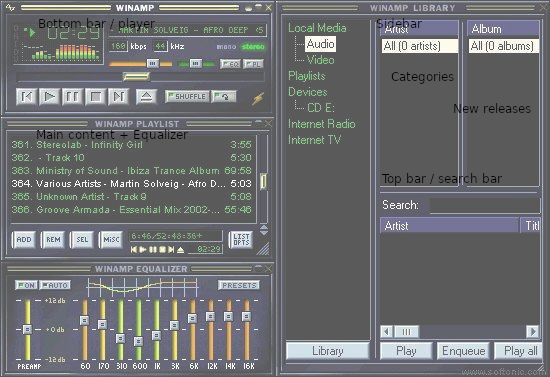

# Winampify
This project was bootstrapped with [Create React App](https://github.com/facebook/create-react-app), using `--template typescript`
#### Goals:
- [X] Integrate application with Spotify Web API.
- [X] ***Apply styling as close as possible to Winamp.***
- [X] Make content displayable and playable.
- [X] Apply application state (use either Redux library or similar or React mechanisms like
Context API or hooks).
- [ ] Visualise data loading states.
- [ ] Add unit tests (no need to apply coverage for edge cases, focus on main possible
issues).
- [ ] Add at least one UI test for a happy path related scenario.
- [X] It must be possible to run the app by doing just yarn &amp;&amp; yarn start (of course,
you can use npm install &amp;&amp; npm start).
- [X] ***Implement separate “User profile” screen (details to display are free of choice) and
apply routing to the application.***

## Dependencies
- React.js
- Typescript
- Node.js
- Express.js
- Node-sass
- Redux 
- Redux-saga

---

## UI


---

## Documentation
- src
    - [components](#components)
        - [UserProfile](#userprofile)
        - [TopBar](#topbar)
        - [MainContent](#maincontent)
        - [BottomBar](#bottombar)
        - [SideBar](#sidebar)
            - [Categories](#categories)
            - [NewReleases](#newreleases)
        - shared
            - hoc
    - [store](#redux-store)
        - [state](#state)
    - [`App.tsx`](#react-app)
- [`index.js`](#server)

---

### Server
#### Authentication
> Authentication is handled entirely by Spotify Web API. Once user is authenticated by the platform, his token is stored within redux store. Each consecutive request will refresh the token.

#### Development
> To start developing fill the [environment variables](#environment-variables), and simply `npm install && npm start`
#### Environment variables
```sh
# CONFIG
HOST_PORT                 = 8080
PORT                      = 3000

# SPOTIFY WEB API
REACT_APP_SPOTIFY_WEB_API = 'https://accounts.spotify.com'
REACT_APP_CLIENT_ID       = $SPOTIFY_CLIENT_ID
REACT_APP_CLIENT_SECRET   = $SPOTIFY_CLIENT_SECRET
REACT_APP_WINAMPIFY_ROOT  = 'https://winampify.com'
REACT_APP_WINAMPIFY       = 'https://winampify.com/api/auth'
REACT_APP_WINAMPIFY_DEV   = 'https://winampify.com/api/auth/develop'
REACT_APP_DISABLE_AUTH    = 'true' # any other value enables auth

SPOTIFY_WEB_API           = 'https://accounts.spotify.com/authorize'
SPOTIFY_CLIENT_ID         = $SPOTIFY_CLIENT_ID
SPOTIFY_SECRET            = $SPOTIFY_CLIENT_SECRET
SPOTIFY_REDIRECT_URI      = 'https://winampify.com'
SPOTIFY_REDIRECT_URI_DEV  = 'https://winampify.com/develop'

# API
API_AUTH                  = 'https://winampify.com/api/auth'
API_AUTH_DEV              = 'https://winampify.com/api/auth/develop'
```

#### Scripts
```javascript
    "dev": "nodemon . NODE_ENV='develop'",      // Run server in development mode
    "serve": "node . NODE_ENV='production'",    // Run server in production mode
    "start": "react-scripts start",             // Start local client server
    "build": "react-scripts build",             // Generate production build with CRA
```

---

### React App

#### Redux Store
##### State
- auth
    - loading
    - token
- spotify
    - loading
    - playlists
- user
    - loading
    - data
- theme
    - current

---

### Components 
##### Layout
> Component which puts children in correct places using flex-boxes.

##### TopBar
> Navigation into user profile and change theme button

##### Search 
> Containing search component where user can search for artists tracks etc.

##### BrowserList
> Displaying search results in a list-like fashion.

##### Sidebar
> Consists of Artist, Album, Search and Details, all connected to logged-in user playlists.

#### UserProfile
> View displaying user details

---

### Sources
> - ``Open 24 Display ST`` font by [Southtype](https://www.dafont.com/south-type.d5515)
> - The scss themes functionality was based on the tutorial made by [Jason McAffe](https://medium.com/@jasonlmcaffee/theming-with-react-and-sass-c7a6882fd26b).
> - The react audio player was loosely based on the tutorial made by [Thomas Pikauli](https://dev.to/ma5ly/lets-make-a-little-audio-player-in-react-p4p)
